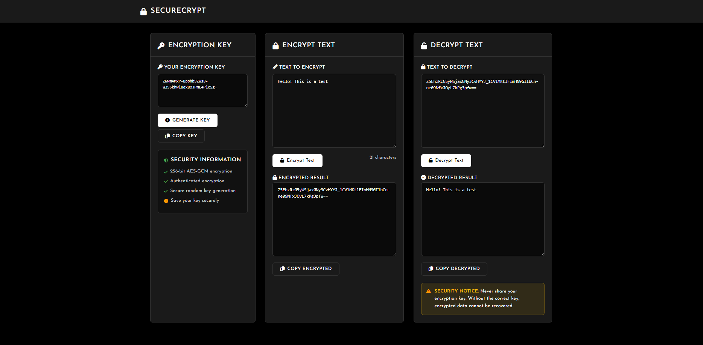

# SecureCrypt

-  A sleek, black-themed AES-GCM encryption tool

## Features

-  256-bit AES-GCM (Galois/Counter Mode)
-  Confidentiality + Integrity protection
-  Instant encryption/decryption
-  Easy copy-to-clipboard functionality
-  Web-Based: No installation required

## Screenshots

 
</div>

## Stack

**Backend:**
- **Python 3.9+** - Core programming language
- **Flask** - Lightweight web framework
- **cryptography** - Industry-standard crypto library
- **Gunicorn** - Production WSGI server

**Frontend:**
- **HTML5** - Semantic markup
- **CSS3** - Modern styling with custom properties
- **JavaScript (ES6+)** - Interactive functionality
- **Josefin Sans** - Elegant typography
- **Font Awesome** - Icon library

**Security:**
- **AES-GCM** - Authenticated encryption algorithm
- **256-bit keys** - Military-grade key strength
- **Secure random** - OS-level entropy source
- **Base64 URL-safe** - Safe encoding for transmission

1. **Clone the repository:**
   ```bash
   git clone https://github.com/Olivers-L/securecrypt.git
   cd securecrypt